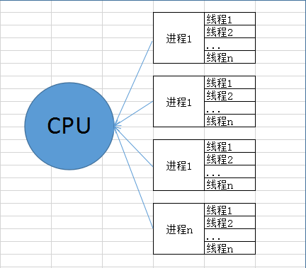

# 线程的介绍

## 基于线程的并行

在学习前，先了解了解什么是线程(Thread)是操作系统能够运算调度的更小单位，相对进程来说的。被包含在进程之中，一个线程指的是进程中一个单一顺序的控制流，一个进程可以包含多个线程，每个线程并行执行不同任务（比如多线程爬虫，一个线程不断爬，一个线程不断解析网页内容）。一张图来说明：



线程是可以由系统直接操作的执行单元，不过线程是不能单独运行的，是依赖在进程之上，由进程提供多个线程控制，线程总是在进程得到上下文中运行的，每个线程都有他自己的一组CPU寄存器，称为线程的上下文，该上下文反映了线程上次运行该线程的CPU寄存器的状态。

- 线程可以被抢占（中断）。
- 在其他线程正在运行时，线程可以暂时搁置（也称为睡眠） -- 这就是线程的退让。

线程可以分为:

- 内核线程：由操作系统内核创建和撤销。
- 用户线程：不需要内核支持而在用户程序中实现的线程。


## Python3 线程模块，threading

最早是有thread 模块，不过已被废弃。用户可以使用 threading 模块代替。Python3 将 thread 重命名为 "_thread"。多线程支持，推荐使用threading模块。

threading模块提供了一个Thread类来创建一个线程对象。这个类方法和前面将的Process类是有相似之处的。

```python
class threading.Thread(group=None, target=None, name=None, args=(), kwargs={}, *, daemon=None)
```

**group**，应该为 None；为了日后扩展ThreadGroup类实现而保留。

**target**，是用于run()方法调用的可调用对象。默认是None，表示不需要调用任何方法。

**name**，是线程名称。默认情况下，由 “Thread-N” 格式构成一个唯一的名称，其中 N 是小的十进制数。

**args**，是用于调用目标函数的参数元组。默认是 ()。

**kwargs**，是用于调用目标函数的关键字参数字典。默认是 {}。如果不是None，daemon 参数将显式地设置该线程是否为守护模式。 如果是 None (默认值)，线程将继承当前线程的守护模式属性。

**如果子类型重载了构造函数，它一定要确保在做任何事前，先发起调用基类构造器(Thread._\_init_\_())。**

## threading创建线程

```python
import threading
import time

def print_time(threadName, delay):
    print ("%s: %s" % (threadName, time.ctime(time.time())))
    time.sleep(delay)
    
if __name__ == '__main__':
    thread = threading.Thread(target=print_time, name='test', args=('test', 3,))
    thread.start()
    thread.join()
```

是不是很像多进程中的进程创建Process。从参数，到支持的方法都差不多，也有start，join的方法。另外，线程的执行顺序也和进程一样，是不固定的。

下一篇将介绍threading关键的一些方法，以及案例讲解。